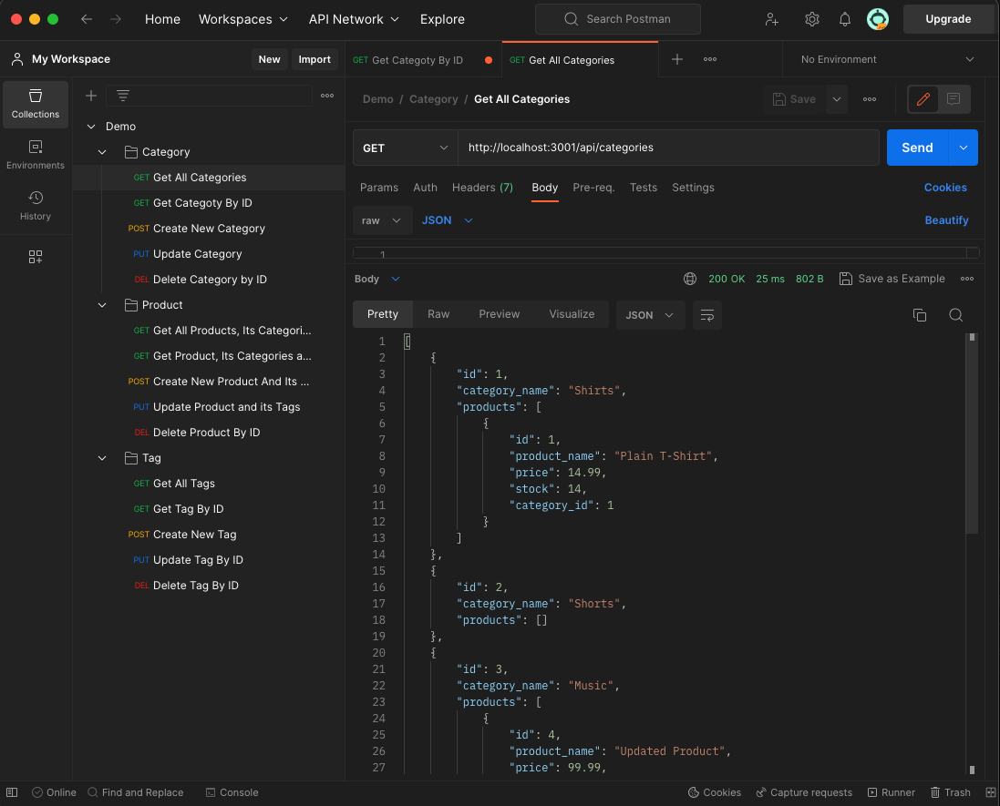

# E-Commerce Back End
[](https://opensource.org/licenses/MIT)    


--- 
> The `E-Commerce Back End` app was developed as a component of the Berkeley Coding Bootcamp Challenge 13. The `e-commerce back end` can manage product inventory of the online store to effectively manage their online sales and customer information.
- The recorded [video](https://1drv.ms/v/s!Ak2qWe8ZT6ny2Uo2H3c2wwYBd9dK?e=eVkGd5) on the screen demonstrates how the E-Commerce Back End application operates.

---
## Table of Contents
* [General Information](#general-information)
* [Preview](#preview)
* [Technologies Used](#technologies-used)
* [Installation](#installation)
* [Usage](#usage)
* [Project Status](#project-status)
* [User Story](#user-story)
* [Acceptance Criteria](#acceptance-criteria)
* [Contact](#contact)
* [License](#license)

---
## General Information 
>The main purpose of the `E-Commerce Back End` application is to enhance the experience of internet retailer owners by facilitating the storage and management of inventory in a database. The development of the application was done accordingly to [user story](#user-story) and [acceptance criteria](#acceptance-criteria). 

---
## Preview 


---
## Technologies Used
-  JavaScript
-  Node.js v18.12.1
-  Exspress v4.17.1
-  Mysql2 v2.1.0
-  Sequelize v5.21.7
-  Dotenv v8.2.0

---
## Installation
>To use the `E-Commerce Back End`, the user must first [clone](https://github.com/UserOlena/e-commerce-back-end) the repository to their local computer. Once the repository is successfully located on the computer, the user must install the necessary packages for the application to function. It is essential to have `node.js` installed on the computer, which can be downloaded from the official [web-site](https://nodejs.org/en). It is recommended to download `Node.js v18.12.1` since this application has only been tested with that version. Once `Node.js v18.12.1` is installed, the user should navigate to the `E-Commerce Back End` repository using the command line by typing `cd ~/...` and replacing `...` with the path to the `E-Commerce Back End` directory. Once in that directory, type `npm init -y` in the command line to install `node` modules. It is crucial to ensure that packages are installed within the `E-Commerce Back End` directory, where `server.js` is located. Additionally user must provide their information to access the database. The file `connection.js` can be found inside the [config](./config/connection.js) folder. User must replace `process.env...` with their information in order to access the database. After database name, mysql user_name and user password is included in the `connection.js`, the user can start setting the database. To create the database user must type `mysql -u username -p` in the command line replacing the username with the user's name associated with mysql. Once logged in, they need to execute the command `source db/schema.sql` to create the database. To exit the `mysql` shell, the user needs to type `exit` and press `enter`. After the database is created, the user will need to define the table structure by creating the columns and their respective attributes. To achieve that, user will need to start the server executing `npm start` command in the command line. After tables are defined, user must change 
```
sequelize.sync({ force: true });
```
to
```
sequelize.sync({ force: false });
```
in the `seeds/index.js` to avoid the recreation of tables in the future on the server start. An essential step for the application to function properly is to seed the database. After exiting the server using the keyboard combination `Ctrl + C`, the user should execute the command `node seeds/index.js` to initiate the database seeding process. Finally, the user can call the application by typing `npm start` in the command line.

---
## Usage
- To utilize the `E-Commerce Back End`, it is necessary to complete all the steps outlined in the Installation section.
- After completing the installation steps, the user can access the `E-Commerce Back End` by navigating through the command line to the `E-Commerce Back End` directory where all the necessary `node` modules and the `server.js` file are located. They can then call the application by typing `npm start` in the command line to start the server.

---
## Project Status 
>Project is: Complete 

---
## User Story
```md
AS A manager at an internet retail company
I WANT a back end for my e-commerce website that uses the latest technologies
SO THAT my company can compete with other e-commerce companies
```  

---
## Acceptance Criteria
```md
GIVEN a functional Express.js API
WHEN I add my database name, MySQL username, and MySQL password to an environment variable file
THEN I am able to connect to a database using Sequelize
WHEN I enter schema and seed commands
THEN a development database is created and is seeded with test data
WHEN I enter the command to invoke the application
THEN my server is started and the Sequelize models are synced to the MySQL database
WHEN I open API GET routes in Insomnia for categories, products, or tags
THEN the data for each of these routes is displayed in a formatted JSON
WHEN I test API POST, PUT, and DELETE routes in Insomnia
THEN I am able to successfully create, update, and delete data in my database
```  
---
### Additional Requarements
#### Database Models

Your database should contain the following four models, including the requirements listed for each model:

* `Category`

  * `id`

    * Integer.
  
    * Doesn't allow null values.
  
    * Set as primary key.
  
    * Uses auto increment.

  * `category_name`
  
    * String.
  
    * Doesn't allow null values.

* `Product`

  * `id`
  
    * Integer.
  
    * Doesn't allow null values.
  
    * Set as primary key.
  
    * Uses auto increment.

  * `product_name`
  
    * String.
  
    * Doesn't allow null values.

  * `price`
  
    * Decimal.
  
    * Doesn't allow null values.
  
    * Validates that the value is a decimal.

  * `stock`
  
    * Integer.
  
    * Doesn't allow null values.
  
    * Set a default value of `10`.
  
    * Validates that the value is numeric.

  * `category_id`
  
    * Integer.
  
    * References the `Category` model's `id`.

* `Tag`

  * `id`
  
    * Integer.
  
    * Doesn't allow null values.
  
    * Set as primary key.
  
    * Uses auto increment.

  * `tag_name`
  
    * String.

* `ProductTag`

  * `id`

    * Integer.

    * Doesn't allow null values.

    * Set as primary key.

    * Uses auto increment.

  * `product_id`

    * Integer.

    * References the `Product` model's `id`.

  * `tag_id`

    * Integer.

    * References the `Tag` model's `id`.

#### Associations

You'll need to execute association methods on your Sequelize models to create the following relationships between them:

* `Product` belongs to `Category`, and `Category` has many `Product` models, as a category can have multiple products but a product can only belong to one category.

* `Product` belongs to many `Tag` models, and `Tag` belongs to many `Product` models. Allow products to have multiple tags and tags to have many products by using the `ProductTag` through model.

---
## Contact
-  [Olena P](https://github.com/UserOlena)

---
## License
>This project is open source and available under the [MIT](./LICENSE)
